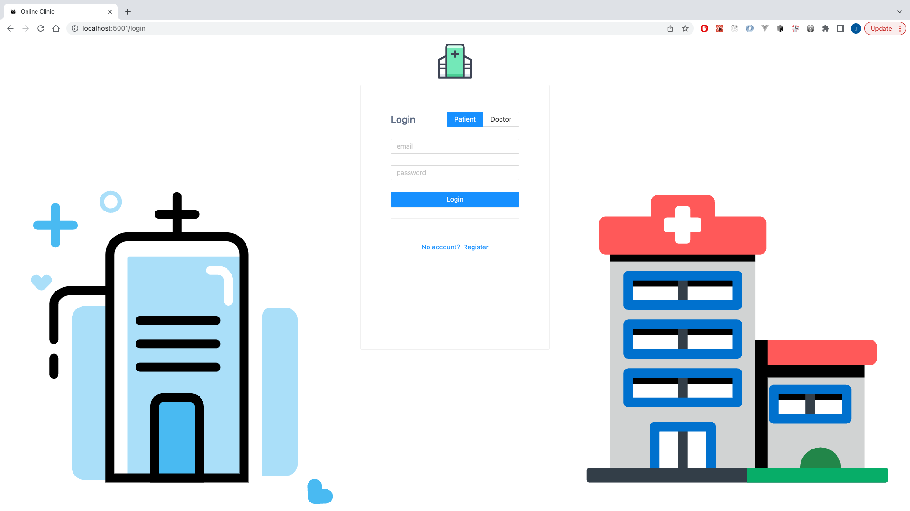
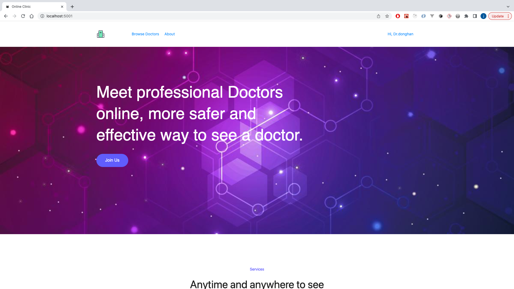
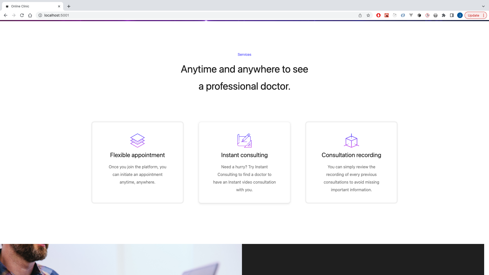
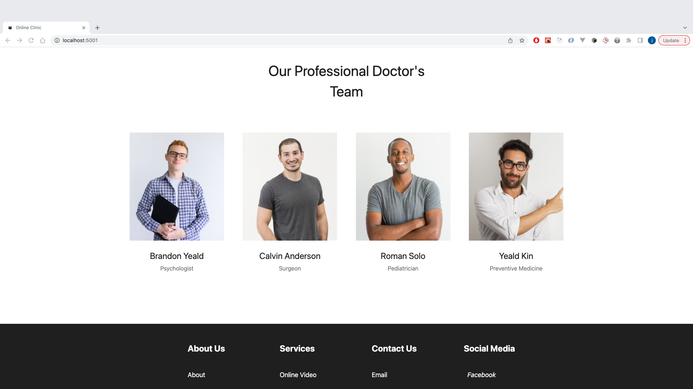
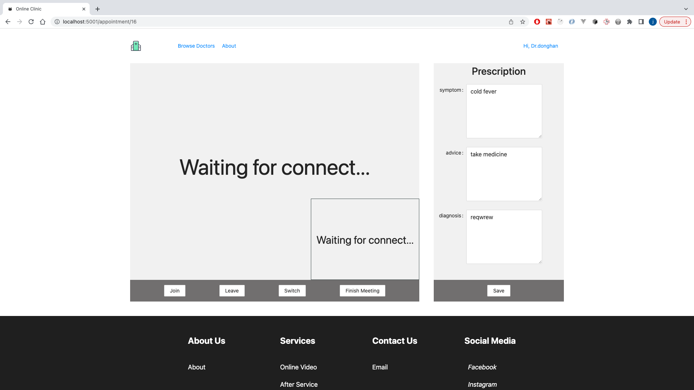
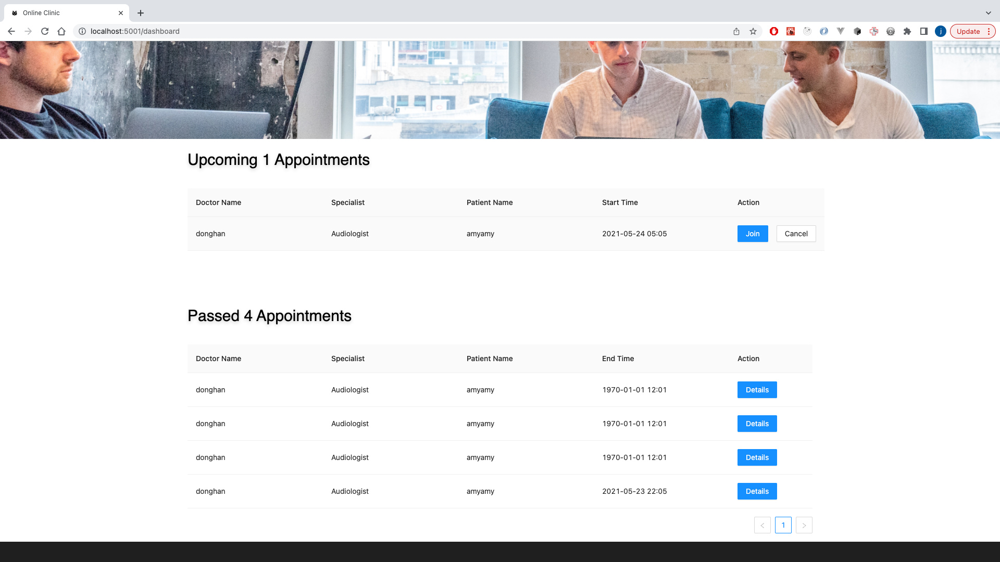

# Online Hospital Project for IFN711

## Demo

## Login Page


## Index page



## Meeting page


## Appointment page


# Build Setup

## Development
This monorepo was built using TypeScript, Node.js and React.
All backend and frontend in the same monorepo

### Benefits
* easy to development
* easy to maintain
* backend and frontend shares same models
* easy to deploy

### Before Development  
* run `yarn install` 
* packages/hospital-backend/database/online-hospital.sql saves mysql table info
* reference /packages/hospital-backend/configs/environments/development.ts as development config
`yarn run app` start both frontend and backend

or
 
```
yarn workspace xxx run start
```
## Architecture

* yarn (no npm!)
* typescript
* eslint + prettier
  
### frontend
* react（use functional components）
* antd
  
### backend(typestack)
* koa
* typeorm
* mysql
### common
 `packages/common` save common typescript models

## technical details
### config
/packages/hospital-backend/configs/environments/

use development and production environments
### user authentication
JWT
[JWT](https://zhuanlan.zhihu.com/p/158186278?from_voters_page=true)

### video and audio communication
[Agora Web API Reference](https://docs.agora.io/cn/faq/API%20Reference/web/index.html)

### live chat
[Websocket](https://developer.mozilla.org/zh-CN/docs/Web/API/WebSocket)

### deploy
CICD： Docker + Github Actions

## git
* before merge master，squash your branch first，then rebase master, let our master commits be a straight line
* before start pull request 前，make sure all commits are head of master
* please use english for commit logs
* commit rules: eg `xxx: message`
    * `feat: add xxx function`
    * `fix: fix xxx problem`
* reference [《Contributing to Angular - Commit Message Guidelines》](https://github.com/angular/angular/blob/master/CONTRIBUTING.md#-commit-message-guidelines)
